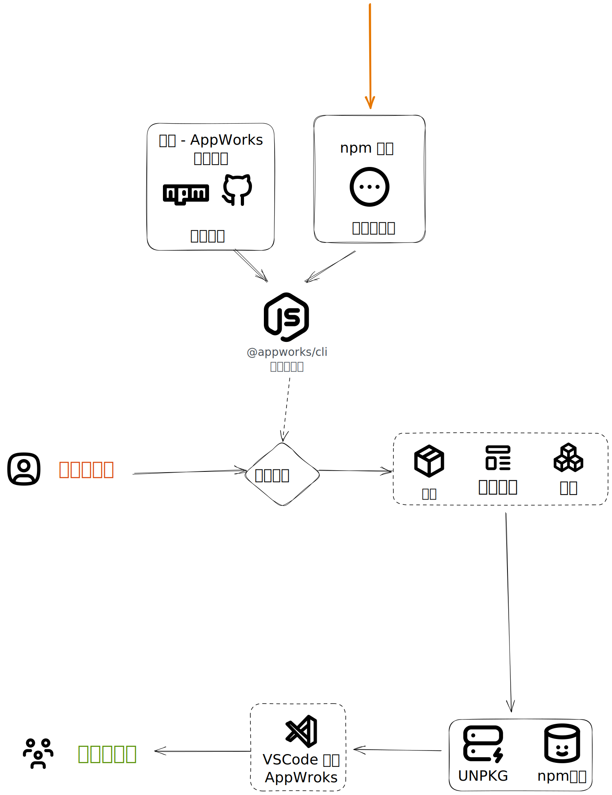

# AppWorks 物料模板仓库

## 介绍

这是一个关于 [AppWorks](https://appworks.site/) 的的前端物料模板仓库，有关 AppWorks 的物料仓库的主流程可以用下图来描述，而我们这个仓库就是途中橙色箭头所处的位置。

<br>



<br>

这个仓库与 [原仓库](https://github.com/ice-lab/material-templates) 有何不同？
- 由于我是一个Vue开发者，所以我希望使用Vue这边的技术栈来开发物料模板，同时，我希望使用 pnpm + bumpp 来实现统一的发版。

## 物料模板

在 AppWorks 的体系中，物料并不是一定要严格按照物料模板的格式进行开发的，但是，假如你需要开发多个物料，并且物料会有多个开发者共同维护，此时，将物料进行一定的规范可以减少重复劳动。

### 物料模板的结构

> [⚡ 官方文档](https://appworks.site/materials/reference/custom.html#%E5%BC%80%E5%8F%91%E8%87%AA%E5%AE%9A%E4%B9%89%E7%89%A9%E6%96%99%E6%A8%A1%E6%9D%BF)

```bash
./packages/template-xxx
├── CHANGELOG.md            # 【可选】版本变更记录
├── package.json            # 物料模板的配置也在此处定义
├── README.md               # 物料模板的说明文档，你可以在这里留下一些信息提示后面的维护者如何对你定义的模板进行维护
└── template                # 模板列表，必须包含至少一个模板
    ├── block               # 区块模板
    ├── component           # 组件模板
    └── scaffold            # 脚手架模板
```

#### `package.json`

核心的字段是 `files`、`materialConfig`、`name` 、`version`。

- `files`：指定了物料模板的目录结构，这个字段指定了模板被打包时的文件有哪些，有时候，为了调试模板，你也会希望不打包某些文件，可以用 `!templates/xxx` 来排除 。默认值： `["templates"]`
- `materialConfig`：物料模板的配置，通常只需制定项目类型，类型是可以自定义的： `{ "type": "vue"} `
- `name`：物料模板的名称，
- `version`：物料模板的版本，对代码做版本管理总是不会错的。

```json
{
  "name": "template-xxx",
  "version": "0.1.0",
  "files": ["template"],
  "materialConfig": {
    "type": "vue"
  }
}
```

**注意**：`materialConfig.type` 这个值是在你创建应用、物料时用来指定物料模板的，所以你可以自定义这个值，但是，你需要在你的物料模板中提供对应的模板。

#### template

到这里，你所有的代码都是后面其他开发者生产物料时使用 `appworks init` 或者 `appworks add` 命令时生成的代码，这个 `template` 目录下的代码才是真正的物料模板。

这里需要做出一些特殊的约束，避免诸如 `.gitignore` 产生的问题。通常来说，这些问题可以通过重命名文件来解决，一般只需要在你需要重命名的文件后面加上 `.ejs`，将他变成模板代码即可 。

具体参考 [特殊文件名称约定](https://appworks.site/materials/reference/custom.html#%E5%BC%80%E5%8F%91%E8%87%AA%E5%AE%9A%E4%B9%89%E7%89%A9%E6%96%99%E6%A8%A1%E6%9D%BF)

- `block`：区块模板，用于创建区块。
- `component`：组件模板，用于创建组件。
- `scaffold`：脚手架模板，用于创建项目。

##### 物料模板调试

1. 假如物料模板本身使用pnpm管理依赖，那么，你可以在物料模板的根目录下执行 `pnpm install --ignore-workspace` 来安装依赖。
